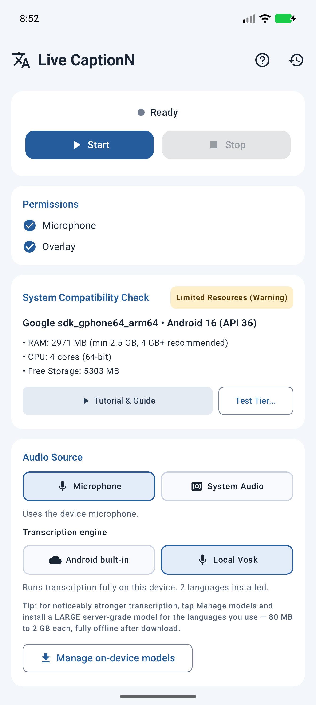
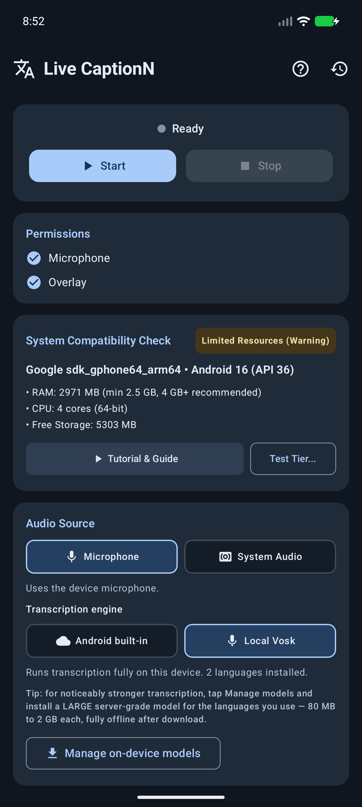
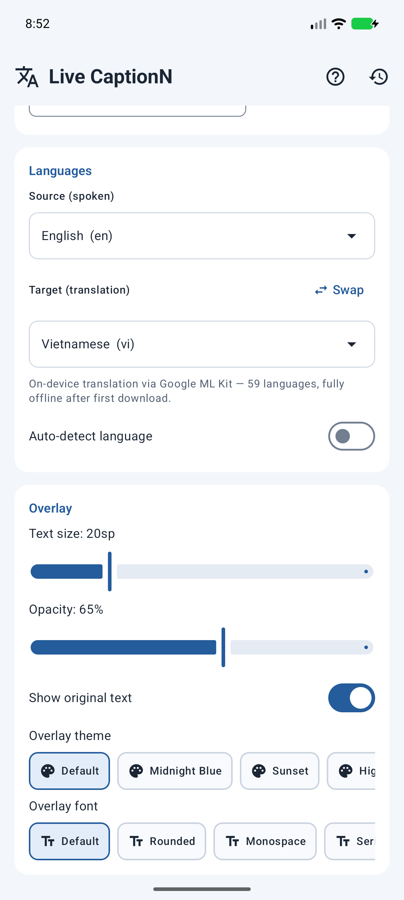
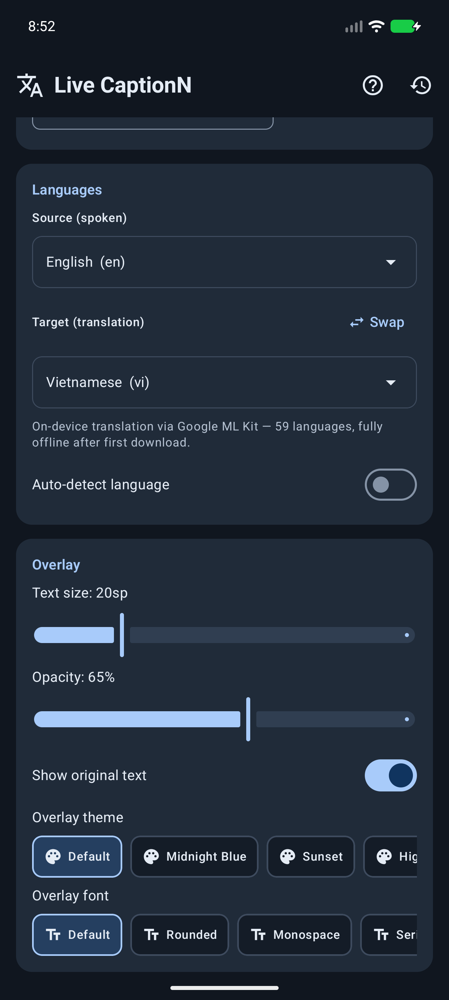
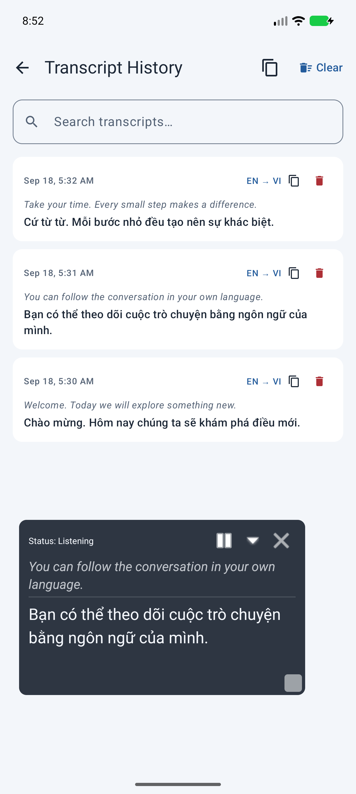
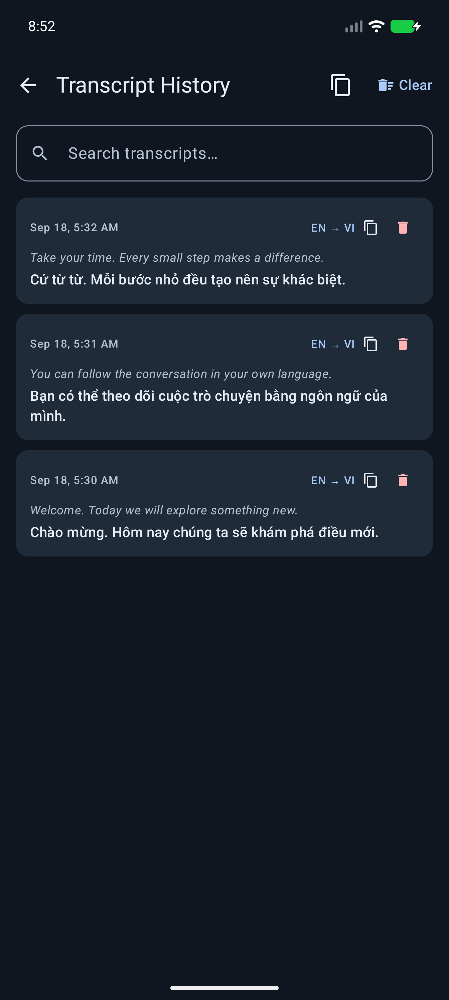

<div align="center">

# LiveCaptionN

This is an independent fork maintained by meliorisse. No support is offered for this version. The app’s About this fork card includes a manual update check against this fork’s GitHub releases; checks also run at launch and periodically in the background.

**Real-time speech transcription and EN ⇄ VI translation, floating over any Android app.**

[](https://github.com/meliorisse/LiveTranscribe-Android/actions/workflows/build.yml)
[](https://github.com/meliorisse/LiveTranscribe-Android/releases/latest)
[](LICENSE)
[](#requirements)

### [Source code](https://github.com/meliorisse/LiveTranscribe-Android/tree/self-build-pro) · [Setup guide](docs/remote-setup.html) · [Download APK](https://github.com/meliorisse/LiveTranscribe-Android/releases/latest)

</div>

---

LiveCaptionN listens through the microphone (or the currently playing app audio), transcribes what it hears in **real time** — word by word as you speak — translates between any supported language pair, and paints the result as a draggable caption window on top of whatever you are watching or browsing. It is built for people watching foreign-language videos, following along in a meeting, or studying another language hands-free.

Both stages of the pipeline can run **fully on-device**: streaming Vosk handles speech-to-text (one long-lived recognizer fed ~100 ms audio chunks continuously), and Google ML Kit handles the text-to-text translation with ~59 languages cached offline after a one-time ~30 MB per-pair download. No server required. If you would rather use a LibreTranslate server for wider language coverage or a Whisper ASR endpoint for STT, both paths are still available in settings.

## Demo

<div align="center">

[Watch the earlier demo](docs/assets/video/demo.mp4) — this recording predates the current fork’s appearance; see the updated screenshots below.

</div>

## Screenshots

Current fork, following Android’s light/dark setting. These are unedited emulator captures; transcript and overlay text are sample content. The overlay example uses the Default theme at 90% opacity.

<div align="center">

**Main screen · Light and dark**

&nbsp;&nbsp;


**Language settings · Light and dark**

&nbsp;&nbsp;


**Floating captions · Transcript history**

&nbsp;&nbsp;


</div>

Screenshot capture instructions are in [docs/screenshots.md](docs/screenshots.md).

## Features

- **Floating caption overlay** — draggable, resizable `SYSTEM_ALERT_WINDOW` window that sits on top of any app, with Pause, Minimize, and Close controls.
- **Live streaming on-device recognition** — a continuous Vosk pipeline feeds ~100 ms PCM chunks into one long-lived recognizer and emits partial results as the words are spoken (not batched 2-second chunks), so captions feel like Google Live Caption.
- **Mic _and_ system audio, same engine** — switch between the microphone and `MediaProjection` audio capture without changing backends. Both paths stream through the same low-latency pipeline.
- **Multiple speech engines** — streaming on-device Vosk (default), Android's on-device `SpeechRecognizer` (Android 12+, same engine as Google Live Caption), or a remote Whisper HTTP endpoint as a fallback.
- **On-device translation via ML Kit** — Google's pre-trained Translate models run entirely on the phone. ~59 supported languages, ~30 MB per language pair (one-time download), cached offline forever after that. LibreTranslate is still available as an alternative backend for wider coverage.
- **Any language your backend supports** — the picker shows ML Kit's supported languages, your LibreTranslate server's `/languages` list, or only the Vosk models installed on this phone, whichever combination you choose.
- **Built-in Vosk model downloader** — two quality tiers: **Small** (~30–80 MB, fast and light) and **Large** server-grade models (80 MB to 2 GB, lowest error rates) for Spanish, French, German, Russian, Chinese, Japanese, Hindi, Arabic, and more.
- **Automatic update notifications** — a background WorkManager job polls the GitHub releases API; when a new version is published you get a system notification with a one-tap Download action, plus an in-app banner the next time you open the app.
- **Transcript history** — every session is saved locally, searchable with per-entry delete from the history screen.
- **Shareable transcript history** — copy or share saved transcripts as plain text, with stable entry deletion and safer recovery if storage is interrupted.
- **Guided setup and readiness checks** — first launch explains the required permissions and the app prevents unusable caption sessions before they start.
- **Caption presets** — save and reuse common language and display setups.
- **Pro glossary** — define custom phrases and replacements for names, terminology, and recurring translations.
- **Tunable overlay** — text size, opacity, width/height, "show original" toggle (dual-line original + translated display), minimized state, and remembered screen position.
- **Private by default** — speech processing and translation both run against endpoints you configure. No accounts, no mandatory telemetry (Firebase Analytics/Crashlytics only in release builds, disabled in debug).
- **Pro included in this fork** — GitHub/self-built APKs include Ad-Free, larger Vosk models, all translation languages, overlay themes/fonts, Pro presets, and glossary replacements without payment, an account, or a billing server. The separate Play Store flavor retains its original billing behavior.

## Translating different languages

LiveCaptionN is a two-stage pipeline: **speech → text** happens in a speech engine, then **text → text** happens in LibreTranslate. You can mix and match.

### Path A — LibreTranslate (broad language coverage)

Point the app at any LibreTranslate-compatible server and it fetches `GET /languages` on startup (and whenever you change the URL). Whatever the server reports shows up in both the Source and Target pickers — typically English, Spanish, French, German, Italian, Portuguese, Russian, Chinese, Japanese, Korean, Arabic, Hindi, Vietnamese, and ~15 more depending on which Argos Translate packages are installed.

To add more languages, install extra packages on the server:

```bash
# On the machine running LibreTranslate
argospm update
argospm install translate-en_ja translate-en_ko translate-en_fa
# …then restart LibreTranslate
```

See the [LibreTranslate docs](https://github.com/LibreTranslate/LibreTranslate#install-argos-translate-packages) for the full list.

### Path B — On-device Vosk (offline, no server needed for STT)

When you select **System Audio → Local Vosk** the source-language picker collapses to just the Vosk models that are installed on this phone. Two models ship inside the APK (English and Vietnamese). Tap **Manage on-device models** to download additional ones — the app fetches them from `alphacephei.com/vosk/models` over HTTPS, unzips to app-private storage, and instantly makes that language available in the picker. Uninstalling frees the disk space.

> On-device transcription still uses LibreTranslate for the text → text step, so you need the translation server reachable if you want captions in a different language than the one being spoken. If the source and target match (for example, English speech → English captions), no translation call is made.

## Quick install

1. Download the latest APK from the [releases page](https://github.com/meliorisse/LiveTranscribe-Android/releases/latest).
2. On your Android device, enable **Install unknown apps** for your browser / file manager if prompted.
3. Open the APK and install.
4. Launch LiveCaptionN and grant **Microphone**, **Display over other apps**, and **Notifications** permissions. (Notifications are used for update alerts only — no telemetry.)
5. (Optional) Point the Translation base URL at your own LibreTranslate server.
6. Tap **Start Captioning**, then switch to any app you want to watch or listen to.

After install, the app checks the GitHub Releases API roughly twice a day in the background. When a new version ships, you'll get a notification with a one-tap Download action — and an in-app banner on the main screen the next time you open the app.

> Minimum Android version: **Android 10 (API 29)**. Target: **Android 15 (API 35)**.

## How it works

```
┌─────────────┐    ┌─────────────────────────┐    ┌────────────────┐    ┌──────────────┐
│ Mic / Media │ ─▶ │ StreamingSttEngine      │ ─▶ │ Translation    │ ─▶ │ Floating     │
│ Projection  │    │ (100ms chunks → Vosk    │    │ (LibreTranslate│    │ overlay on   │
│ audio       │    │  streaming recognizer)  │    │  HTTP server)  │    │ other apps   │
└─────────────┘    └─────────────────────────┘    └────────────────┘    └──────────────┘
```

One `AudioRecord` reads 16 kHz mono PCM in ~100 ms chunks from either the microphone (`VOICE_RECOGNITION`) or `AudioPlaybackCaptureConfiguration`, feeds each chunk straight into a long-lived Vosk `Recognizer`, and emits **partial** results (`isFinal=false`) every chunk plus **final** segments on Vosk's silence boundaries. A foreground `CaptionForegroundService` wires everything together, debounces translation requests (~400 ms), and pushes updates into a `StateFlow` that both the Compose main screen and the Android-Views overlay observe.

## Architecture at a glance

- **MVVM with manual DI** — all dependencies wired through `AppContainer` (created in `LiveCaptionApp`). No Hilt.
- **`TranslationRepository`** — abstraction with `LibreTranslateRepository` (Retrofit) and `MockTranslationRepository` for tests.
- **`SpeechEngine`** — abstraction implemented by `StreamingSttEngine` (default, streaming Vosk for mic and system audio), `AndroidSpeechRecognizerManager` (platform on-device recognizer, Android 12+), and `SystemAudioEngine` (legacy batch path that POSTs WAVs to a remote Whisper endpoint).
- **`VoskStreamingSession`** — keeps one `Recognizer` alive for the whole session so partial results stay coherent across chunks.
- **`UpdateChecker` + `UpdateCheckWorker`** — WorkManager periodic job that queries the GitHub Releases API, compares against `BuildConfig.VERSION_CODE`, and posts a notification via `UpdateNotifier` when a new build is out.
- **`CaptionRuntimeStore`** — in-memory `MutableStateFlow` holding live caption state.
- **`SettingsRepository`** — DataStore Preferences persistence for every user-visible setting plus overlay position.
- **Overlay** — traditional Android Views via `WindowManager` (Compose does not play well with `SYSTEM_ALERT_WINDOW`).

For deeper notes see [`CLAUDE.md`](CLAUDE.md).

## Translation backend

LiveCaptionN talks to any LibreTranslate-compatible server. The default endpoint is `http://localhost:3006` and is configurable in the main screen.

- `GET /languages` — list supported languages
- `POST /translate` — body: `{ q, source, target, format: "text" }`

You can self-host LibreTranslate with Docker in a few minutes — see the [LibreTranslate project](https://github.com/LibreTranslate/LibreTranslate).

## Quick Settings shortcut

In the app, open **About this fork → Add quick action** to add the **Floating translation** tile (Android 13+). On older Android versions, edit the Quick Settings panel and add it manually. Tap the tile from any app to start captioning with your saved settings; tap again to stop. Complete setup first. Android still asks for microphone or screen-capture permission when required. The app follows the system light/dark theme independently of the overlay theme.

## Build from source

Requires **JDK 17** and the Android SDK. Tested with Android Studio Hedgehog+.

```bash
# Clone
git clone https://github.com/meliorisse/LiveTranscribe-Android.git
cd LiveTranscribe-Android

# Debug APK
./gradlew assembleGithubDebug

# Release APK (unsigned)
./gradlew assembleGithubRelease

# Unit tests
./gradlew testGithubDebugUnitTest

# Instrumentation tests (connected device required)
./gradlew connectedAndroidTest
```

Output APKs land in `app/build/outputs/apk/`. The GitHub flavor grants permanent local Pro access and disables ads in both debug and release builds; no Stripe or Firebase configuration is needed, and Firebase telemetry is not initialized. Its update checker points to `meliorisse/LiveTranscribe-Android`. The MIT license and upstream attribution remain in place. GitHub Actions in this fork runs the tests and uploads debug and unsigned release APK artifacts without requiring repository secrets or publishing releases automatically.

## Requirements

| Item | Value |
|---|---|
| Min SDK | 29 (Android 10) |
| Target / Compile SDK | 35 (Android 15) |
| Language | Kotlin |
| UI | Jetpack Compose + Material 3 (main), Android Views (overlay) |
| Build tool | Gradle 8 + AGP |

## Tech stack

Kotlin · Coroutines & Flow · Jetpack Compose · Material 3 · Retrofit · OkHttp · Moshi · DataStore Preferences · Vosk · WindowManager · MediaProjection · Foreground Service

## Roadmap

- Additional language pairs beyond EN ⇄ VI
- On-device translation models
- Accessibility-service experiments for richer in-app context
- Per-app overlay profiles

## Contributing

Issues and pull requests are welcome. Before opening a PR:

1. Run `./gradlew test` and make sure it passes.
2. Keep changes focused — one concern per PR.
3. If you change overlay rendering, include a screenshot.

## License

See [`LICENSE`](LICENSE).

### Automatic language detection in this fork

Enable **Auto-detect language** and restart captioning after changing speech settings.

- **On-device translation:** a bundled, offline language detector selects the source language from recognized text. Uncertain or unsupported results fall back to the selected source language; the screen shows detection and fallback status.
- **Android microphone recognition:** Android 14+ is asked to detect and switch speech languages. This requires a compatible recognizer and downloaded speech models. Older Android versions require manual speech-language selection.
- **Remote Whisper system audio:** automatic mode omits the fixed source language so your configured server can detect it. Use a multilingual Whisper model. Short audio clips may be ambiguous.
- **Local Vosk:** optional offline Whisper Tiny language identification can now switch between installed Vosk models for both microphone and system audio. See setup below.

With auto-detect disabled, both microphone and system-audio paths respect the selected source language. LibreTranslate continues to handle automatic text-language detection on your configured server.


### Offline speech-language detection with Vosk

1. Select **Local Vosk** and download the speech models you want from the source-language picker. Small Vosk models are recommended to limit memory use while switching.
2. Enable **Auto-detect language**, then choose **Download detector** (103 MB).
3. Optionally select **Enabled speech languages**. With none selected, all installed Vosk languages are eligible. The source-language picker selects the initial model and the fallback when the detector is unavailable.
4. Restart captioning after downloads or language-setting changes.

The detector runs locally for either microphone or system audio. It checks independent four-second audio windows and requires two agreeing windows before switching to another enabled, installed Vosk language. Those windows are buffered and replayed into the chosen recognizer. Expect about 4–8 seconds of buffering plus device-dependent inference and model-loading time. Manual mode retains immediate streaming.

Unsupported, disabled, or unavailable languages keep the current Vosk model and show a notice. An inference failure disables speech detection for that session while captioning continues with the current model. A missing detector uses the manually selected model. Silence is filtered using an amplitude threshold; this is not a full speech/music classifier. Whisper's language-ID API returns a top language, not calibrated confidence: short, noisy, musical, or mixed-language audio can still be misidentified. Pausing or stopping discards uncommitted buffered audio.

The processing queue is bounded. A device that cannot keep up reports an error instead of silently dropping captured speech. Use smaller Vosk models or disable auto-detect if this happens. The language attached to each caption is also used as the text-translation fallback.

#### Model provenance and builds

- Runtime detector downloads are hosted in this fork's [model asset release](https://github.com/meliorisse/LiveTranscribe-Android/releases/tag/language-id-model-v1), separate from app updates. Both files are verified against pinned byte counts and SHA-256 hashes before installation.
- Whisper Tiny multilingual int8 models are mirrored unchanged from [this pinned ONNX conversion](https://huggingface.co/csukuangfj/sherpa-onnx-whisper-tiny/tree/65176e2deb88badc814a94058666cadccc29b61c). Whisper is MIT licensed.
- The build fetches [sherpa-onnx 1.13.8](https://github.com/k2-fsa/sherpa-onnx/releases/tag/v1.13.8) directly from its maintainers and verifies the AAR SHA-256 before compilation. sherpa-onnx is Apache-2.0 licensed; ONNX Runtime is MIT licensed. License texts ship in the APK under assets/licenses.
- Detection requires no server and makes no audio uploads. The optional download and native runtime increase disk/memory use.

Native integration tests are in VoskSpeechLanguageTest. Install a debug build, download the external speech fixtures linked in scripts/test-language-id.py, run that helper with adb on PATH, then run connectedGithubDebugAndroidTest with android.testInstrumentationRunnerArguments.class=com.charles.livecaptionn.VoskSpeechLanguageTest. These opt-in tests verify production model downloads, real English/German language detection, Vosk switching, and concurrent model lifetimes; they skip when fixtures are absent.
